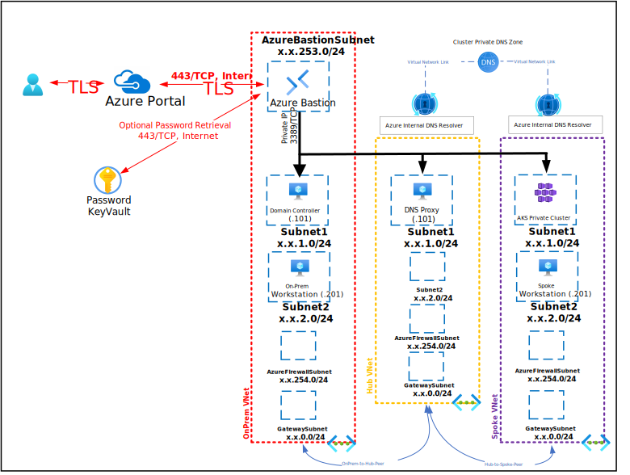

# Description

This Deployment deploys the following items:

- 3 - Virtual Networks (On-Prem/Hub/Spoke)
- 1 - Bastion Host
- 1 - Azure Private DNS Zone
- 1 - User Managed Identity
- 2 - Azure Private DNS Zone Virtual Network Links
- 1 - DNS Proxy Server (Conditional Forwarders for OnPremise DNS and Azure Private DNS Zone)
- 1 - AKS Management Workstation (On AKS/Spoke VNet)(Windows 11/10)
- 1 - OnPremise Domain Controller (Conditional forwarder for AKS Private DNS Zone)
- 1 - OnPremise Workstation(Windows 11/10))
- 1 - Azure KeyVault with Secret contianing Deployment Password

The deployment leverages Desired State Configuration scripts to further customize the following:

All Virtual Machines can be accessed via the [Bastion Host](https://docs.microsoft.com/en-us/azure/bastion/bastion-overview) that was deployed by using the Username and Password provided during depoyment.  The password can be manually entered or retrieved from the KeyVault that is creatd during deployment.

If you can't remember the Password used during deployment it is also written to an Encrypted Secret within the deployed KeyVault and can be retrieved as shown below:

If you can't remember the Username review the Deployment Input tab within your Resources Groups Deployment

Parameters that support changes
- TimeZone.  Select an appropriate Time Zone.
- AutoShutdownEnabled.  Yes = AutoShutdown Enabled, No = AutoShutdown Disabled.
- AutoShutdownTime.  24-Hour Clock Time for Auto-Shutdown (Example: 1900 = 7PM)
- AutoShutdownEmail.  Auto-Shutdown notification Email (Example:  user@domain.com)
- Admin Username.  Enter a valid Admin Username
- Admin Password.  Enter a valid Admin Password
- Azure UserObject ID.  Object ID for the Azure Using running the deployment
- WindowsServerLicenseType.  Choose Windows Server License Type (Example:  Windows_Server or None)
- WindowsClientLicenseType.  Choose Windows Client License Type (Example:  Windows_Client or None)
- Naming Convention. Enter a name that will be used as a naming prefix for (Servers, VNets, etc) you are using.
- Sub DNS Domain.  OPTIONALLY, enter a valid DNS Sub Domain. (Example:  sub1. or sub1.sub2.    This entry must end with a DOT )
- Sub DNS BaseDN.  OPTIONALLY, enter a valid DNS Sub Base DN. (Example:  DC=sub1, or DC=sub1,DC=sub2,    This entry must end with a COMMA )
- Net Bios Domain.  Enter a valid Net Bios Domain Name (Example:  killerhomelab).
- Internal Domain.  Enter a valid Internal Domain (Exmaple:  killerhomelab)
- InternalTLD.  Select a valid Top-Level Domain using the Pull-Down Menu.
- Vnet0ID. Enter first 2 octets of your desired Address Space for OnPrem Virtual Network (Example: 10.1)
- Vnet1ID. Enter first 2 octets of your desired Address Space for Spoke Virtual Network 1 (Example: 10.20)
- Vnet2ID. Enter first 2 octets of your desired Address Space for Hub Virtual Network 1 (Example: 10.21)
- PODID. Enter first 2 octets for podCIDR (Example: 10.30)
- SERVICEID. Enter first 2 octets for serviceCIDR (Example: 10.31)
- Reverse Lookup0. Enter first 2 octets for VNet0ID (OnPrem) in Reverse (Example: 1.10)
- Reverse Lookup1. Enter first 2 octets for VNet0ID (Hub) in Reverse (Example: 21.10)
- DNSOSSku. Select 2022-Datacenter (Windows 2022), 2019-Datacenter (Windows 2019), 2016-Datacenter (Windows 2016) or 2012-R2-Datacenter (Windows 2012 R2) DNS Proxy OS Sku
- DC1OSSku. Select 2022-Datacenter (Windows 2022), 2019-Datacenter (Windows 2019), 2016-Datacenter (Windows 2016) or 2012-R2-Datacenter (Windows 2012 R2) Domain Controller 1 OS Sku
- WK1OSSku. Select Windows-11, Windows-10 or Windows-7 Worksation 1 OS Sku
- DNSVMSize. Enter a Valid VM Size based on which Region the VM is deployed.
- DC1VMSize. Enter a Valid VM Size based on which Region the VM is deployed.
- WKVMSize. Enter a Valid VM Size based on which Region the VM is deployed.