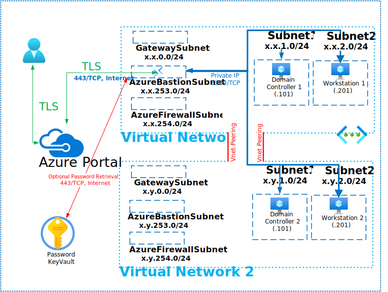

# Active Directory Multi Site

This Deployment deploys the following items:

- 2 - Virtual Networks
- 1 - Bastion Host
- 1 - Active Directory Forest/Domain
- 2 - Domain Controllers
- 2 - Domain Joined Windows Workstations (Windows 11/10/7)
- 1 - Azure KeyVault with Secret contianing Deployment Password

The deployment leverages Desired State Configuration scripts to further customize the following:

- Configure 1st Domain Controller
- Configure Reverse DNS Zone 1 and Point Records
- Configure Organizational Unit Structure
- Configure AD Sites Unit Structure
- Update Virtual Network 1 DNS with Domain Controller 1 IP
- Update Virtual Network 2 DNS with Domain Controller 1 IP
- Restart Domain Controller 1
- Configure 2nd Domain Controller
- Configure Reverse DNS Zone 2 and Point Records
- Update Virtual Network 2 DNS with Domain Controller 2 IP
- Restart Domain Controller 2
- Domain Join Workstation 1
- Domain Join Workstation 2

All Virtual Machines can be accessed via the [Bastion Host](https://docs.microsoft.com/en-us/azure/bastion/bastion-overview) that was deployed by using the Username and Password provided during depoyment.  The password can be manually entered or retrieved from the KeyVault that is created during deployment.

If you can't remember the Password used during deployment it is also written to an Encrypted Secret within the deployed KeyVault and can be retrieved as shown below:

If you can't remember the Username review the Deployment Input tab within your Resources Groups Deployment

Parameters that support changes
- TimeZone.  Select an appropriate Time Zone.
- AutoShutdownEnabled.  Yes = AutoShutdown Enabled, No = AutoShutdown Disabled.
- AutoShutdownTime.  24-Hour Clock Time for Auto-Shutdown (Example: 1900 = 7PM)
- AutoShutdownEmail.  Auto-Shutdown notification Email (Example:  user@domain.com)
- Admin Username.  Enter a valid Admin Username
- Admin Password.  Enter a valid Admin Password
- Azure UserObject ID.  Object ID for the Azure Using running the deployment
- WindowsServerLicenseType.  Choose Windows Server License Type (Example:  Windows_Server or None)
- WindowsClientLicenseType.  Choose Windows Client License Type (Example:  Windows_Client or None)
- Naming Convention. Enter a name that will be used as a naming prefix for (Servers, VNets, etc) you are using.
- Sub DNS Domain.  OPTIONALLY, enter a valid DNS Sub Domain. (Example:  sub1. or sub1.sub2.    This entry must end with a DOT )
- Sub DNS BaseDN.  OPTIONALLY, enter a valid DNS Sub Base DN. (Example:  DC=sub1, or DC=sub1,DC=sub2,    This entry must end with a COMMA )
- Net Bios Domain.  Enter a valid Net Bios Domain Name (Example:  killerhomelab).
- Internal Domain.  Enter a valid Internal Domain (Example:  killerhomelab)
- InternalTLD.  Select a valid Top-Level Domain using the Pull-Down Menu.
- Vnet1ID.  Enter first 2 octets of your desired Address Space for Virtual Network 1 (Example:  10.1)
- Vnet2ID.  Enter first 2 octets of your desired Address Space for Virtual Network 2 (Example:  10.2)
- Reverse Lookup1.  Enter first 2 octets of your desired Address Space in Reverse (Example:  1.10)
- Reverse Lookup2.  Enter first 2 octets of your desired Address Space in Reverse (Example:  2.10)
- DC1OSSku.  Select 2022-Datacenter (Windows 2022), 2019-Datacenter (Windows 2019), 2016-Datacenter (Windows 2016) or 2012-R2-Datacenter (Windows 2012 R2) Domain Controller 1 OS Sku
- DC2OSSku.  Select 2022-Datacenter (Windows 2022), 2019-Datacenter (Windows 2019), 2016-Datacenter (Windows 2016) or 2012-R2-Datacenter (Windows 2012 R2) Domain Controller 2 OS Sku
- DC1OSVersion.  The default is Latest however a specific OS Version can be entired based on the above OS Sku.
- DC2OSVersion.  The default is Latest however a specific OS Version can be entired based on the above OS Sku.
- DC1VMSize.  Enter a Valid VM Size based on which Region the VM is deployed.
- DC2VMSize.  Enter a Valid VM Size based on which Region the VM is deploed.
- WK1OSSku.  Select Windows-11, Windows-10 or Windows-7 Worksation 1 OS Sku
- WK2OSSku.  Select Windows-11, Windows-10 or Windows-7 Worksation 2 OS Sku
- WK1OSVersion.  The default is Latest however a specific OS Version can be entired based on the above OS Sku.
- WK2OSVersion.  The default is Latest however a specific OS Version can be entired based on the above OS Sku.
- WK1VMSize.  Enter a Valid VM Size based on which Region the VM is deployed.
- WK2VMSize.  Enter a Valid VM Size based on which Region the VM is deployed.