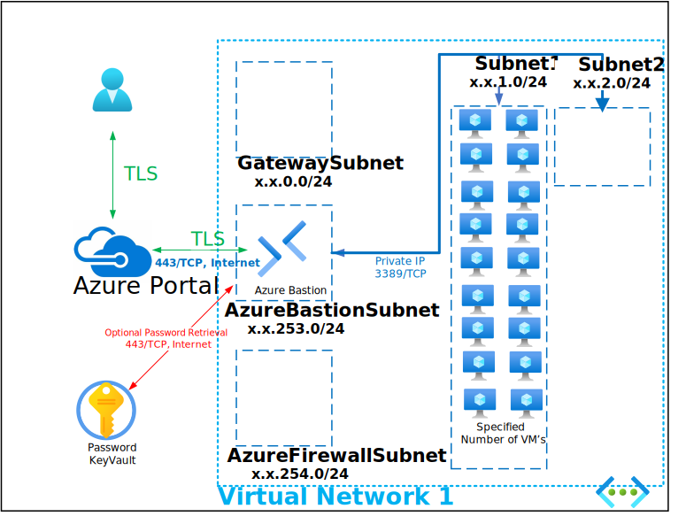

# Deploy Additional Domain Controllers

This Deployment deploys the following items:

- 1 - Virtual Network
- 1 - Network Security Group
- Specified Number of Virtual Machines

All Virtual Machines can be accessed via the [Bastion Host](https://docs.microsoft.com/en-us/azure/bastion/bastion-overview) that was deployed by using the Username and Password provided during depoyment.  The password can be manually entered or retrieved from the KeyVault that is creatd during deployment.

If you can't remember the Password used during deployment it is also written to an Encrypted Secret within the deployed KeyVault and can be retrieved as shown below:

If you can't remember the Username review the Deployment Input tab within your Resources Groups Deployment

Parameters that support changes
- NumberOfVMInstances.  Number of VM's to be Deployed
- VMInitialNumber.  Starting number of Virtual Machine numbering Sequence
- TimeZone.  Select an appropriate Time Zone.
- Admin Username.  Enter a valid Admin Username
- Admin Password.  Enter a valid Admin Password
- Azure UserObject ID.  Object ID for the Azure Using running the deployment
- WindowsServerLicenseType.  Choose Windows Server License Type (Example:  Windows_Server or None)
- WindowsClientLicenseType.  Choose Windows Client License Type (Example:  Windows_Client or None)
- Naming Convention. Enter a name that will be used as a naming prefix for (Servers, VNets, etc) you are using.
- VnetID.  Enter first 2 octets of your desired Address Space for Virtual Network 1 (Example:  172.16)
- VMOSKU. Select 2022-Datacenter (Windows 2022), 2019-Datacenter (Windows 2019) or 2016-Datacenter (Windows 2016)
- VMSize. Enter a Valid VM Size based on which Region the VM is deployed.