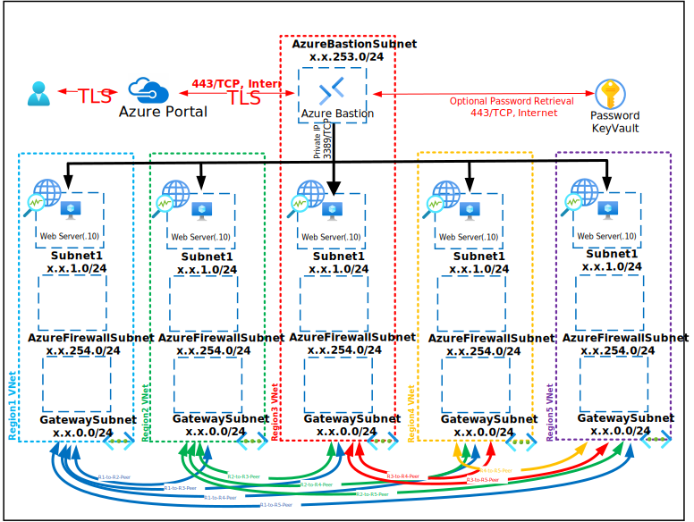

# Deploy-Azure-NetworkWatcher-Monitor

Deploys 5 VM's that utilize Network Watcher to test traffic via VNet Peering between all VM's on each Virtual Network running IIS over port 80/TCP using the Connection Monitor feature of Network Watcher.

This Deployment deploys the following items:

- 5 - Resource Groups
- 5 - Virtual Networks
- 1 - Bastion Host
- 1 - Network Watcher (Connection Monitor)
- 5 - Virtual Machines (Connected to Log Analytics Workspace)(Destination IIS Server)
- 1 - Azure KeyVault with Secret contianing Deployment Password

The deployment leverages Desired State Configuration scripts to further customize the following:

The deployment leverages Desired State Configuration scripts to further customize the following:

- Install Internet Information Services (IIS)

All Virtual Machines can be accessed via the [Bastion Host](https://docs.microsoft.com/en-us/azure/bastion/bastion-overview) that was deployed by using the Username and Password provided during depoyment.  The password can be manually entered or retrieved from the KeyVault that is creatd during deployment.

If you can't remember the Password used during deployment it is also written to an Encrypted Secret within the deployed KeyVault and can be retrieved as shown below:

If you can't remember the Username review the Deployment Input tab within your Resources Groups Deployment

Parameters that support changes
- Region1RG.  Resource Group for Region 1 Resources.
- Region2.  Location for Region 2 Resources.
- Region2RG.  Resource Group for Region 2 Resources.
- Region3.  Location for Region 3 Resources.
- Region3RG.  Resource Group for Region 3 Resources.
- Region4.  Location for Region 4 Resources.
- Region4RG.  Resource Group for Region 4 Resources.
- Region5.  Location for Region 5 Resources.
- Region5RG.  Resource Group for Region 5 Resources.
- TimeZone.  Select an appropriate Time Zone.
- AutoShutdownEnabled.  Yes = AutoShutdown Enabled, No = AutoShutdown Disabled.
- AutoShutdownTime.  24-Hour Clock Time for Auto-Shutdown (Example: 1900 = 7PM)
- AutoShutdownEmail.  Auto-Shutdown notification Email (Example:  user@domain.com)
- Admin Username.  Enter a valid Admin Username
- Admin Password.  Enter a valid Admin Password
- Azure UserObject ID.  Object ID for the Azure Using running the deployment
- WindowsServerLicenseType.  Choose Windows Server License Type (Example:  Windows_Server or None)
- Naming Convention. Enter a name that will be used as a naming prefix for (Servers, VNets, etc) you are using.
- Vnet1ID.  Enter first 2 octets of your desired Address Space for Region 1 VNet 1 (Example:  172.16)
- Vnet2ID.  Enter first 2 octets of your desired Address Space for Region 1 VNet 1 (Example:  172.17)
- Vnet3ID.  Enter first 2 octets of your desired Address Space for Region 1 VNet 1 (Example:  172.18)
- Vnet4ID.  Enter first 2 octets of your desired Address Space for Region 1 VNet 1 (Example:  172.19)
- Vnet5ID.  Enter first 2 octets of your desired Address Space for Region 1 VNet 1 (Example:  172.20)