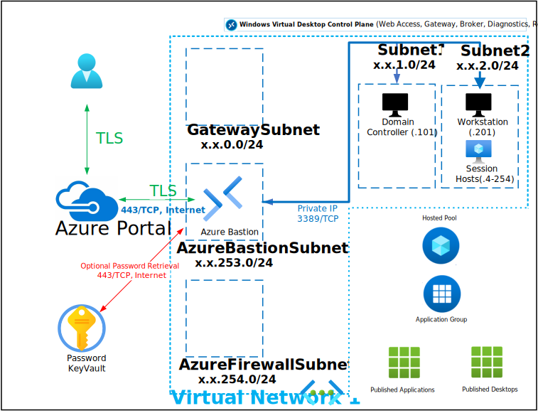

# Deploy Azure Virtual Desktop Active Directory Add-On

THE FOLLOWING DEPLOYMENTS MUST ALREADY EXIST TO USE THIS DEPLOYMENT:

- "Deploy-PKI-2Tier-CA-With-OCSP (PKIDeploymentType = 2-Tier-PKI)" OR "Deploy-PKI-Enterprise-CA-With-OCSP (PKIDeploymentType = Enterprise-PKI)
- Deploy-ADFS-WAP-and-ADConnect-Single-Site

This Deployment deploys the following items:

- 1 - Azure KeyVault with Secret contianing Deployment Password
- 1 - AD Connect Server (Domain-Joined with AD Connect Downloaded for Install)

All Virtual Machines can be accessed via the [Bastion Host](https://docs.microsoft.com/en-us/azure/bastion/bastion-overview) that was deployed by using the Username and Password provided during depoyment.  The password can be manually entered or retrieved from the KeyVault that is creatd during deployment.

If you can't remember the Password used during deployment it is also written to an Encrypted Secret within the deployed KeyVault and can be retrieved as shown below:

If you can't remember the Username review the Deployment Input tab within your Resources Groups Deployment

Parameters that support changes
- TimeZone.  Select an appropriate Time Zone.
- AutoShutdownEnabled.  Yes = AutoShutdown Enabled, No = AutoShutdown Disabled.
- AutoShutdownTime.  24-Hour Clock Time for Auto-Shutdown (Example: 1900 = 7PM)
- AutoShutdownEmail.  Auto-Shutdown notification Email (Example:  user@domain.com)
- HostPoolType.  Set this parameter to Personal if you would like to enable Persistent Desktop experience. Defaults to false.
- personalDesktopAssignmentType.  
- maxSessionLimit.  Maximum number of sessions.
- loadBalancerType.  Type of load balancer algorithm.
- validationEnvironment.  Whether to use validation enviroment.
- VMDiskType.  The VM disk type for the VM: HDD or SSD. (StandardSSD_LRS, Premium_LRS or Standard_LRS.)
- VMNumberOfInstances.  How Many Session Hosts you will need. (Example:  2)
- VMInitialNumber.  Starting number for Session Host Numeric's portion of Name. (Example: 0)
- availabilitySetUpdateDomainCount. The platform update domain count of avaiability set to be created.
- availabilitySetFaultDomainCount. The platform fault domain count of avaiability set to be created.
- Admin Username.  Enter a valid Admin Username
- Admin Password.  Enter a valid Admin Password
- Azure UserObject ID.  Object ID for the Azure Using running the deployment
- WindowsServerLicenseType.  Choose Windows Server License Type (Example:  Windows_Server or None)
- WindowsClientLicenseType.  Choose Windows Client License Type (Example:  Windows_Client or None)
- Naming Convention. Enter a name that will be used as a naming prefix for (Servers, VNets, etc) you are using.
- Sub DNS Domain.  OPTIONALLY, enter a valid DNS Sub Domain. (Example:  sub1. or sub1.sub2.    This entry must end with a DOT )
- Sub DNS BaseDN.  OPTIONALLY, enter a valid DNS Sub Base DN. (Example:  DC=sub1, or DC=sub1,DC=sub2,    This entry must end with a COMMA )
- Net Bios Domain.  Enter a valid Net Bios Domain Name (Example:  killerhomelab).
- Internal Domain.  Enter a valid Internal Domain (Exmaple:  killerhomelab)
- InternalTLD.  Select a valid Top-Level Domain using the Pull-Down Menu.
- Vnet1ID.  Enter first 2 octets of your desired Address Space for Virtual Network 1 (Example:  10.1)