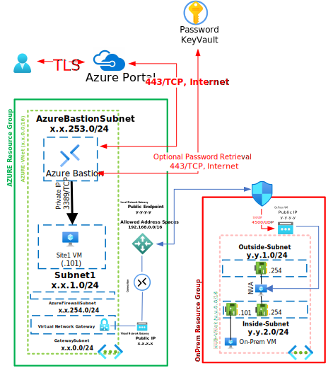

# Azure Virtual Network Gateway RRAS

This Deployment deploys the following items:

- 2 - Resource Groups
- 2 - Virtual Networks
- 1 - Virtual Network Gateway
- 1 - Local Network Gateway
- 1 - Connection1
- 2 - Virtual Machines (Azure, On-Prem)
- 1 - Bastion Host
- 1 - Windows Routing and Remote Access server (VM with 2 NIC's)
- 3 - Route Tables
- 1 - Azure KeyVault with Secret contianing Deployment Password

The deployment leverages Desired State Configuration scripts to further customize the following:

All Virtual Machines can be accessed via the [Bastion Host](https://docs.microsoft.com/en-us/azure/bastion/bastion-overview) that was deployed by using the Username and Password provided during depoyment.  The password can be manually entered or retrieved from the KeyVault that is creatd during deployment.

If you can't remember the Password used during deployment it is also written to an Encrypted Secret within the deployed KeyVault and can be retrieved as shown below:

If you can't remember the Username review the Deployment Input tab within your Resources Groups Deployment

Parameters that support changes
- ONPREMRG.  Resource Group for ONPrem Resources.
- AZURERegion.  Location for AZURE Resources.
- AZURERG.  Resource Group for AZURE Resources.
- TimeZone.  Select an appropriate Time Zone.
- AutoShutdownEnabled.  Yes = AutoShutdown Enabled, No = AutoShutdown Disabled.
- AutoShutdownTime.  24-Hour Clock Time for Auto-Shutdown (Example: 1900 = 7PM)
- AutoShutdownEmail.  Auto-Shutdown notification Email (Example:  user@domain.com)
- Admin Username.  Enter a valid Admin Username
- Admin Password.  Enter a valid Admin Password
- Azure UserObject ID.  Object ID for the Azure Using running the deployment
- WindowsServerLicenseType.  Choose Windows Server License Type (Example:  Windows_Server or None)
- WindowsClientLicenseType.  Choose Windows Client License Type (Example:  Windows_Client or None)
- ONPREMNamingConvention. Enter a name that will be used as a naming prefix for (On-Prem Servers, VNets, etc) you are using.
- AZURENamingConvention. Enter a name that will be used as a naming prefix for (AZURE Servers, VNets, etc) you are using.
- ONPREMVNetID.  Enter first 2 octets of your desired Address Space for OnPrem Virtual Network(Example:  192.168)
- AZUREVNetID.  Enter first 2 octets of your desired Address Space for AZURE Virtual Network(Example:  172.16)
- NVAOSVersion.  Select 2022-Datacenter (Windows 2022), 2019-Datacenter (Windows 2019) or 2016-Datacenter (Windows 2016) Network Virtual Apliance 1 OS Sku
- ONPREMVMOSVersion.  Select 2022-Datacenter (Windows 2022), 2019-Datacenter (Windows 2019) or 2016-Datacenter (Windows 2016) Hub VM 1 OS Sku
- AZUREVMOSVersion.  Select 2022-Datacenter (Windows 2022), 2019-Datacenter (Windows 2019) or 2016-Datacenter (Windows 2016) AZURE VM 1 OS Sku
- NVAVMSize.  Enter a Valid VM Size based on which Region the VM is deployed.
- ONPREMVMSize.  Enter a Valid VM Size based on which Region the VM is deployed.
- AZUREVMSize.  Enter a Valid VM Size based on which Region the VM is deployed.