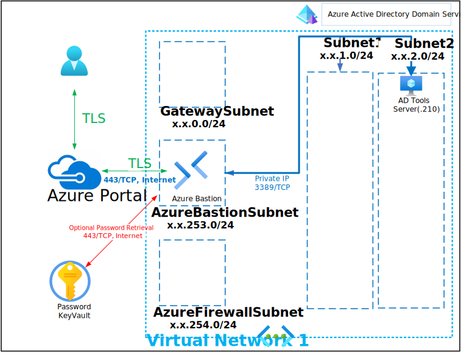

# Deploy Azure AD Domain Services with Tools VM

This Deployment deploys the following items:

- 1 - Azure KeyVault with Secret contianing Deployment Password
- 1 - Virtual Network
- 1 - Network Security Group
- 1 - Azure AD Domain Services Instance
- 1 - Azure AD Domain Services Domain-Joined Server Tools VM (RSAT: AD & DNS)

All Virtual Machines can be accessed via the [Bastion Host](https://docs.microsoft.com/en-us/azure/bastion/bastion-overview) that was deployed by using the Username and Password provided during depoyment.  The password can be manually entered or retrieved from the KeyVault that is creatd during deployment.

If you can't remember the Password used during deployment it is also written to an Encrypted Secret within the deployed KeyVault and can be retrieved as shown below:

If you can't remember the Username review the Deployment Input tab within your Resources Groups Deployment

Parameters that support changes
- TimeZone.  Select an appropriate Time Zone.
- AutoShutdownEnabled.  Yes = AutoShutdown Enabled, No = AutoShutdown Disabled.
- AutoShutdownTime.  24-Hour Clock Time for Auto-Shutdown (Example: 1900 = 7PM)
- AutoShutdownEmail.  Auto-Shutdown notification Email (Example:  user@domain.com)
- AzureADDomainServicesSku.  Select Standard, Enterprise or Premium Sku
- Azure UserObject ID.  Object ID for the Azure Using running the deployment
- Admin Username.  Enter a valid Admin Username
- Admin Password.  Enter a valid Admin Password
- Azure UserName.  Existing User name of Managed Azure Account with "Virtual Machine User Login" rights
- Azure User Password.  Existing Password for Managed Azure Account with "Virtual Machine User Login" rights 
- Azure AD Domain Services Domain.  Choosen name for Azure Active Directory Services Domain Services Name (Example:  killerhomelab.com)
- WindowsServerLicenseType.  Choose Windows Server License Type (Example:  Windows_Server or None)
- Naming Convention. Enter a name that will be used as a naming prefix for (Servers, VNets, etc) you are using.
- Vnet1ID.  Enter first 2 octets of your desired Address Space for Virtual Network 1 (Example:  172.16)
- ADTOOLSOSSku.  Select 2022-Datacenter (Windows 2022), 2019-Datacenter (Windows 2019), 2016-Datacenter (Windows 2016) or 2012-R2-Datacenter (Windows 2012 R2) Domain Controller 1 OS Sku
- ADTOOLSOSVersion.  The default is Latest however a specific OS Version can be entired based on the above OS Sku.
- ADTOOLSVMSize.  Enter a Valid VM Size based on which Region the VM is deployed.