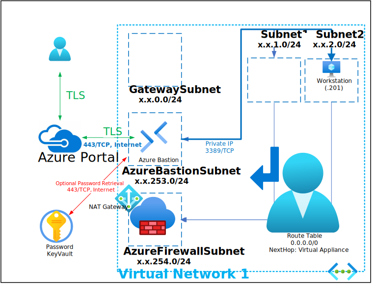
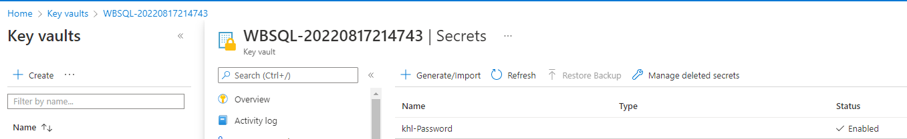
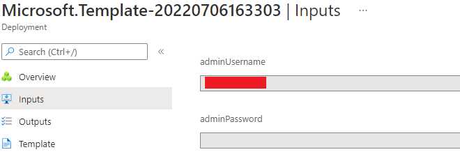

# Deploy Exchange Online Message Tracing Sentinel Ingestion Solution

## THE FOLLOWING TASKS MUST BE DONE PRIOR RUNNING THIS DEPLOYMENT:

### Exchange Admin Role Group Created and granted the following Roles:
- Audit Logs
- Message Tracking
- View-Only Audit Logs
- View-Only Configuration
- View-Only Recipients

### Azure AD User Created and added to previously configured Exchange Admin Role Group

This Deployment deploys the following items:

- 1 - Virtual Network
- 1 - Azure Monitor Private Link Scope (AMPLS)
- 1 - Logic App Standard with VNet Integration with AMPLS Private Endpoint
- 1 - Log Analytics Workspace with Network Isolation with AMPLS Private Endpoint
- 1 - Storage Account with Private Endpoints
- 1 - Windows Workstation (Windows 11/10/7)
- 1 - Azure KeyVault with Secret contianing Deployment Password

All Virtual Machines can be accessed via the [Bastion Host](https://docs.microsoft.com/en-us/azure/bastion/bastion-overview) that was deployed by using the Username and Password provided during depoyment.  The password can be manually entered or retrieved from the KeyVault that is creatd during deployment.

If you can't remember the Password used during deployment it is also written to an Encrypted Secret within the deployed KeyVault and can be retrieved as shown below:

If you can't remember the Username review the Deployment Input tab within your Resources Groups Deployment

Parameters that support changes
- TimeZone.  Select an appropriate Time Zone.
- AutoShutdownEnabled.  Yes = AutoShutdown Enabled, No = AutoShutdown Disabled.
- AutoShutdownTime.  24-Hour Clock Time for Auto-Shutdown (Example: 1900 = 7PM)
- AutoShutdownEmail.  Auto-Shutdown notification Email (Example:  user@domain.com)
- Admin Username.  Enter a valid Admin Username
- Admin Password.  Enter a valid Admin Password
- Azure UserObject ID.  Object ID for the Azure Using running the deployment
- WindowsClientLicenseType.  Choose Windows Client License Type (Example:  Windows_Client or None)
- Naming Convention. Enter a name that will be used as a naming prefix for (Servers, VNets, etc) you are using.
- Vnet1ID.  Enter first 2 octets of your desired Address Space for Virtual Network 1 (Example:  172.1)
- WK1OSSku.  Select Windows-11, Windows-10 or Windows-7 Worksation 1 OS Sku
- WK1VMSize.  Enter a Valid VM Size based on which Region the VM is deployed.