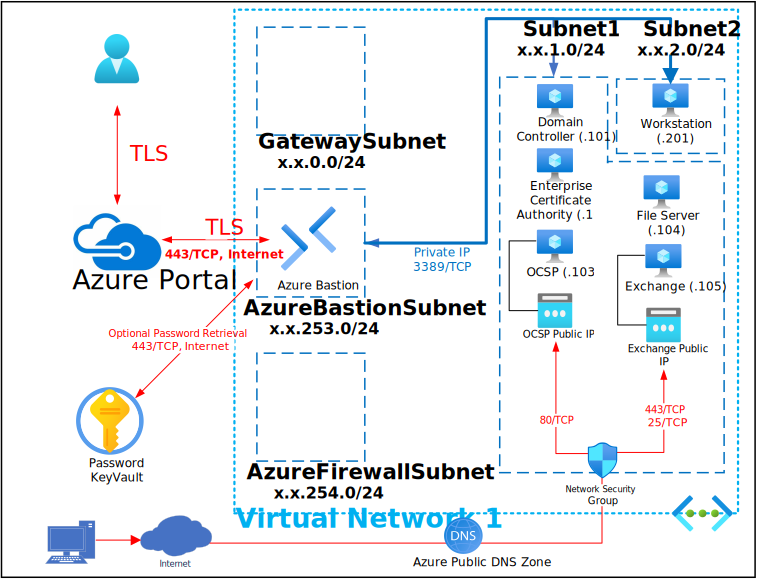
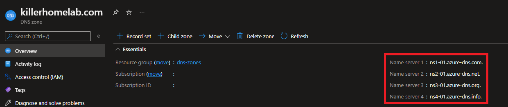

# Exchange 2019 Single Site with Enterprise PKI

This Deployment deploys the following items:

- 1 - Virtual Network
- 1 - Bastion Host
- 1 - Active Directory Forest/Domain
- 1 - Domain Controller
- 1 - Enterprise Certificate Authority Server
- 1 - Online Certificate Status Protocol Server
- 1 - File Share Witness
- 1 - Exchange 2019 Server
- 1 - Domain Joined Windows Workstation (Windows 11/10/7)
- 1 - Network Security Group
- 1 - Azure Public DNS Zone
- 1 - Azure KeyVault with Secret contianing Deployment Password

The deployment leverages Desired State Configuration scripts to further customize the following:

Active Directory
- Configure 1st Domain Controller
- Configure Organizational Unit Structure
- Configure Reverse DNS Zones and Point Records

PKI
- Configure Internal DNS PKI Records
- Configure Enterprise Certificate Authority
- Configure Online Certificate Status Protocol

Exchange
- Configure Internal DNS Exchange Records
- Configure Exchange File Share Witness
- Prepare Active Directory for Exchange
- Install Exchange
- Request/Receive Exchange 2019 SAN Certificate from Enterprise CA
- Exchange 2019 Certificate Enablement
- Exchange Virtual Directory Internal/External Configuration
- Exchange Virtual Directory Authentication Configuration
- Configure Database
- Configure Email Address Policies
- Configure Connectors

All Virtual Machines can be accessed via the [Bastion Host](https://docs.microsoft.com/en-us/azure/bastion/bastion-overview) that was deployed by using the Username and Password provided during depoyment.  The password can be manually entered or retrieved from the KeyVault that is creatd during deployment.

If you can't remember the Password used during deployment it is also written to an Encrypted Secret within the deployed KeyVault and can be retrieved as shown below:

If you can't remember the Username review the Deployment Input tab within your Resources Groups Deployment

This Deployment creates an Azure Public DNS Zone that is capable of providing resolution to external clients.  To use this capability the Name Servers defined within the Azure Public DNS Zone must be notated and used as the External Name Servers of your Name Registrar.  In order to locate these Name Servers navigate to the Azure Public DNS Zone as shown below:

Parameters that support changes
- TimeZone.  Select an appropriate Time Zone.
- AutoShutdownEnabled.  Yes = AutoShutdown Enabled, No = AutoShutdown Disabled.
- AutoShutdownTime.  24-Hour Clock Time for Auto-Shutdown (Example: 1900 = 7PM)
- AutoShutdownEmail.  Auto-Shutdown notification Email (Example:  user@domain.com)
- Exchange Org Name. Enter a name that will be used for your Exchange Organization Name.
- CU11.  Select Yes if Exchange 2019 CU11 is being deployed.  A new License parameter has been introduced in CU11.
- Exchange2019ISOUrl.  You must enter a URL or created SAS URL that points to an Exchange 2019 ISO for this installation to be successful.
- Admin Username.  Enter a valid Admin Username
- Admin Password.  Enter a valid Admin Password
- Azure UserObject ID.  Object ID for the Azure Using running the deployment
- WindowsServerLicenseType.  Choose Windows Server License Type (Example:  Windows_Server or None)
- WindowsClientLicenseType.  Choose Windows Client License Type (Example:  Windows_Client or None)
- To Email.  Please provide a working email address that the Trusted Certificate Authority Chain Can be sent to.  These certificates will allow access to Exchange Services like OWA, EAS and Outlook without Certificate Security warnings. (Depending on What Public IP you get initially.  Exchange mailflow may be blocked if it's blacklisted)
- Naming Convention. Enter a name that will be used as a naming prefix for (Servers, VNets, etc) you are using.
- Sub DNS Domain.  OPTIONALLY, enter a valid DNS Sub Domain. (Example:  sub1. or sub1.sub2.    This entry must end with a DOT )
- Sub DNS BaseDN.  OPTIONALLY, enter a valid DNS Sub Base DN. (Example:  DC=sub1, or DC=sub1,DC=sub2,    This entry must end with a COMMA )
- Net Bios Domain.  Enter a valid Net Bios Domain Name (Example:  killerhomelab).
- Internal Domain.  Enter a valid Internal Domain (Exmaple:  killerhomelab)
- InternalTLD.  Select a valid Top-Level Domain using the Pull-Down Menu.
- External Domain. Enter a valid External Domain (Exmaple: killerhomelab)
- ExternalTLD. Select a valid Top-Level Domain for your External Domain using the Pull-Down Menu.
- Vnet1ID.  Enter first 2 octets of your desired Address Space for Virtual Network 1 (Example:  10.1)
- Reverse Lookup1.  Enter first 2 octets of your desired Address Space in Reverse (Example:  1.10)
- Enterprise CA Name. Enter a Name for your Enterprise Certificate Authority
- EnterpriseCAHashAlgorithm. Hash Algorithm for Enterprise CA
- EnterpriseCAKeyLength. Key Length for Enterprise CA
- DC1OSSku.  Select 2022-Datacenter (Windows 2022), 2019-Datacenter (Windows 2019) or 2016-Datacenter (Windows 2016) Domain Controller 1 OS Sku
- DC1OSVersion.  The default is Latest however a specific OS Version can be entired based on the above OS Sku.
- DC1VMSize.  Enter a Valid VM Size based on which Region the VM is deployed.
- ECAOSSku.  Select 2022-Datacenter (Windows 2022), 2019-Datacenter (Windows 2019) or2016-Datacenter (Windows 2016) Enterprise CA OS Sku
- ECAOSVersion.  The default is Latest however a specific OS Version can be entired based on the above OS Sku.
- ECAVMSize.  Enter a Valid VM Size based on which Region the VM is deployed.
- OCSPOSSku.  Select 2022-Datacenter (Windows 2022), 2019-Datacenter (Windows 2019) or 2016-Datacenter (Windows 2016) OCSP OS Sku
- OCSPOSVersion.  The default is Latest however a specific OS Version can be entired based on the above OS Sku.
- OCSPVMSize.  Enter a Valid VM Size based on which Region the VM is deployed.
- FSOSSku.  Select 2022-Datacenter (Windows 2022), 2019-Datacenter (Windows 2019) or 2016-Datacenter (Windows 2016) File Server OS Sku
- FSOSVersion.  The default is Latest however a specific OS Version can be entired based on the above OS Sku.
- FSVMSize.  Enter a Valid VM Size based on which Region the VM is deployed.
- EXOSSku.  Select 2022-Datacenter (Windows 2022), 2019-Datacenter (Windows 2019) or 2016-Datacenter (Windows 2016) Exchange Server OS Sku
- EXOSVersion.  The default is Latest however a specific OS Version can be entired based on the above OS Sku.
- EXVMSize.  Enter a Valid VM Size based on which Region the VM is deployed.
- WK1OSSku.  Select Windows-11, Windows-10 or Windows-7 Worksation 1 OS Sku
- WK1OSVersion.  The default is Latest however a specific OS Version can be entired based on the above OS Sku.
- WK1VMSize.  Enter a Valid VM Size based on which Region the VM is deployed.