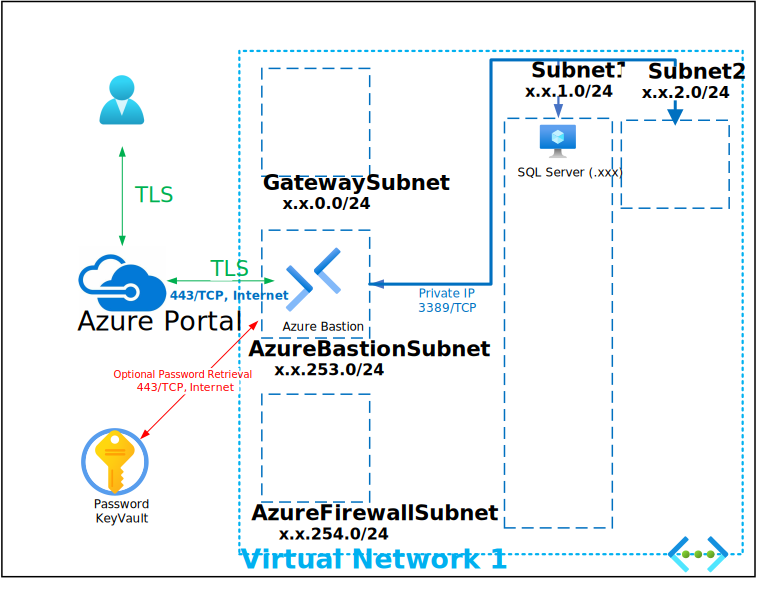

# SQL Server Domain-Joined using an Existing Subnet

This Templates IS MEANT TO BE USED AS AN ADD-ON to the following labs: **** THE PARAMETERS SPECIFIED FOR THIS ADD-ON LAB MUST MATCH THE PARAMETERS OF THE BASE LAB THAT IT WILL BE ADDED TO ****

- ANY DEPLOYMENT WITH AN EXISTING DOMAIN

This Deployment deploys the following items:

- 1 - SQL Server - Domain Joined
- 1 - Azure KeyVault with Secret contianing Deployment Password

The deployment leverages Desired State Configuration scripts to further customize the following:

SQL Deployment
- Install SQL Server 2017/2019/2022
- Installs SQL Management Studio

All Virtual Machines can be accessed via the [Bastion Host](https://docs.microsoft.com/en-us/azure/bastion/bastion-overview) that was deployed by using the Username and Password provided during depoyment.  The password can be manually entered or retrieved from the KeyVault that is creatd during deployment.

If you can't remember the Password used during deployment it is also written to an Encrypted Secret within the deployed KeyVault and can be retrieved as shown below:

If you can't remember the Username review the Deployment Input tab within your Resources Groups Deployment

Parameters that support changes
- TimeZone.  Select an appropriate Time Zone.
- AutoShutdownEnabled.  Yes = AutoShutdown Enabled, No = AutoShutdown Disabled.
- AutoShutdownTime.  24-Hour Clock Time for Auto-Shutdown (Example: 1900 = 7PM)
- AutoShutdownEmail.  Auto-Shutdown notification Email (Example:  user@domain.com)
- ExistingVNetName. Enter the complete name of an Existing Virtual Network
- ExistingSubnetName. Enter the complete name of an Existing Virtual Network Subnet
- SQLServerIP. Enter an IP Address that belongs to ExistingSubnetName
- SQLServerName. Enter the name for the SQL Server
- Admin Username.  Enter a valid Admin Username
- Admin Password.  Enter a valid Admin Password
- Azure UserObject ID.  Object ID for the Azure Using running the deployment
- WindowsServerLicenseType.  Choose Windows Server License Type (Example:  Windows_Server or None)
- Sub DNS Domain.  OPTIONALLY, enter a valid DNS Sub Domain. (Example:  sub1. or sub1.sub2.    This entry must end with a DOT )
- Sub DNS BaseDN.  OPTIONALLY, enter a valid DNS Sub Base DN. (Example:  DC=sub1, or DC=sub1,DC=sub2,    This entry must end with a COMMA ) n
- Internal Domain.  Enter a valid Internal Domain (Exmaple:  killerhomelab)
- InternalTLD.  Select a valid Top-Level Domain using the Pull-Down Menu.
- SQLSASURL. Enter a valid URL that points to the SQL 2019 or 2017 .ISO
- SQLOSVersion. Select 2022-Datacenter (Windows 2022), 2019-Datacenter (Windows 2019) or 2016-Datacenter (Windows 2016) - SQL OS Version
- SQLVMSize. Enter a Valid VM Size based on which Region the VM is deployed.