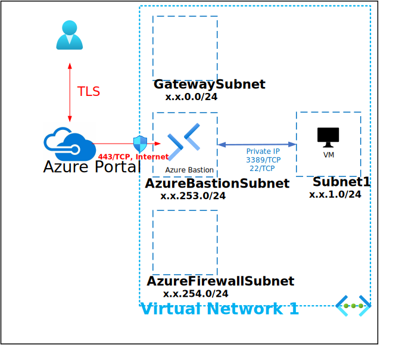

# Deploy Trusted Launch Windows 11 Baseline STIG'd Image

This Deployment deploys the following items:

- 1 - Windows 11 STIG'd Image Gallery/Image Definition

The deployment leverages Desired State Configuration scripts to further customize the following:

- Install PowerSTIG (https://github.com/microsoft/PowerStig)
- Apply Windows 11 Baseline STIGs
- Apply Windows Defender Baseline STIGs
- Apply Windows Firewall Baseline STIGs
- Apply Microsoft Edge Baseline STIGs
- Create Gallery
- Create Image Definition

All Virtual Machines can be accessed via the [Bastion Host](https://docs.microsoft.com/en-us/azure/bastion/bastion-overview) that was deployed by using the Username and Password provided during depoyment.  The password can be manually entered or retrieved from the KeyVault that is creatd during deployment.

If you can't remember the Password used during deployment it is also written to an Encrypted Secret within the deployed KeyVault and can be retrieved as shown below:

If you can't remember the Username review the Deployment Input tab within your Resources Groups Deployment

Parameters that support changes
- TimeZone.  Select an appropriate Time Zone.
- AutoShutdownEnabled.  Yes = AutoShutdown Enabled, No = AutoShutdown Disabled.
- AutoShutdownTime.  24-Hour Clock Time for Auto-Shutdown (Example: 1900 = 7PM)
- AutoShutdownEmail.  Auto-Shutdown notification Email (Example:  user@domain.com)
- VNetName.  Virtual Network Name
- VMSubnetName.  Virtual Machine Subnet Name
- WKName.  Enter Workstation Name
- WKIP.  Enter Workstation IP
- WKSku.  Select win11-22h2-ent or win11-22h2-ent Worksation OS Sku
- WindowsClientLicenseType.  Choose Windows Client License Type (Example:  Windows_Client or None)
- WK1VMSize.  Enter a Valid VM Size based on which Region the VM is deployed.
- Admin Username.  Enter a valid Admin Username
- Admin Password.  Enter a valid Admin Password