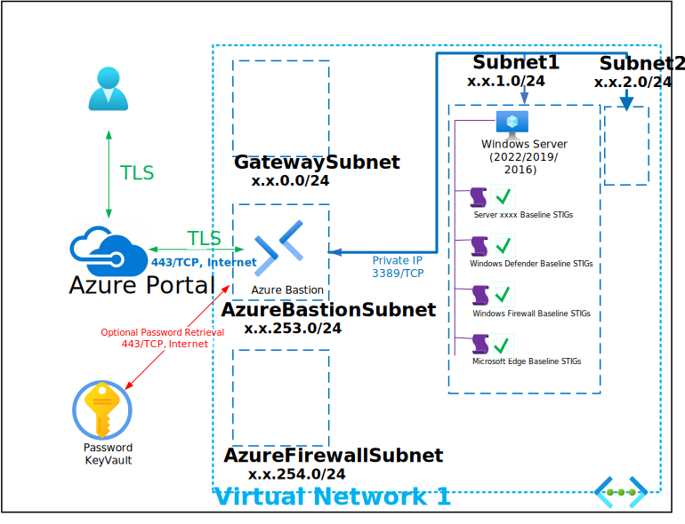

# Deploy Trusted Launch Windows Server Baseline STIG'd VM

This Deployment deploys the following items:

- 1 - Bastion Host
- 1 - Network Security Group
- 1 - Trusted Launch Windows Server (Server 2022, 2019 or 2016)
- 1 - Azure KeyVault with Secret contianing Deployment Password

The deployment leverages Desired State Configuration scripts to further customize the following:

- Install PowerSTIG (https://github.com/microsoft/PowerStig)
- Apply Windows Server 2022/2019/2016 Baseline STIGs
- Apply Windows Defender Baseline STIGs
- Apply Windows Firewall Baseline STIGs
- Apply Microsoft Edge Baseline STIGs

All Virtual Machines can be accessed via the [Bastion Host](https://docs.microsoft.com/en-us/azure/bastion/bastion-overview) that was deployed by using the Username and Password provided during depoyment.  The password can be manually entered or retrieved from the KeyVault that is creatd during deployment.

If you can't remember the Password used during deployment it is also written to an Encrypted Secret within the deployed KeyVault and can be retrieved as shown below:

If you can't remember the Username review the Deployment Input tab within your Resources Groups Deployment

Parameters that support changes
- ApplyWindowsServerBaselineSTIGs. Choose whether to Apply Windows Client Baseline STIGs.
- ApplyWindowsDefenderBaselineSTIGs. Choose whether to Apply Windows Defender Baseline STIGs.
- ApplyWindowsFirewallBaselineSTIGs. Choose whether to Apply Windows Firewall Baseline STIGs.
- ApplyMicrosoftEdgeBaselineSTIGs. Choose whether to Apply Microsoft Edge Baseline STIGs.
- TimeZone.  Select an appropriate Time Zone.
- AutoShutdownEnabled.  Yes = AutoShutdown Enabled, No = AutoShutdown Disabled.
- AutoShutdownTime.  24-Hour Clock Time for Auto-Shutdown (Example: 1900 = 7PM)
- AutoShutdownEmail.  Auto-Shutdown notification Email (Example:  user@domain.com)
- VNetName.  Virtual Network Name
- VMSubnetName.  Virtual Machine Subnet Name
- AzureBastionSubnetPrefix.  Azure Bastion Subnet Prefix (Example:  10.1.1.253.0/24).
- SourceIPRange.  Source Public IP or Public IP Range (Example:  52.x.21.200)
- SRVName.  Enter Server Name
- SRVIP.  Enter Server IP
- SRVSku.  Select 2022-Datacenter-g2, 2019-Datacenter-gensecond or 2019-Datacenter-gensecond Server OS Sku
- WindowsServerLicenseType.  Choose Windows Server License Type (Example:  Windows_Server or None)
- SRV1VMSize.  Enter a Valid VM Size based on which Region the VM is deployed.
- Admin Username.  Enter a valid Admin Username
- Admin Password.  Enter a valid Admin Password
- Azure UserObject ID.  Object ID for the Azure Using running the deployment