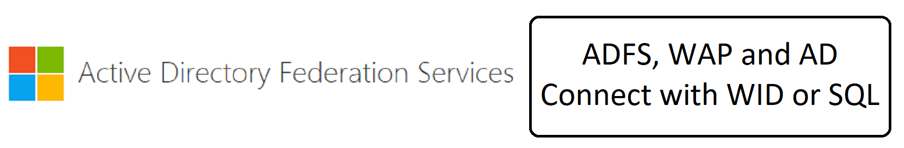
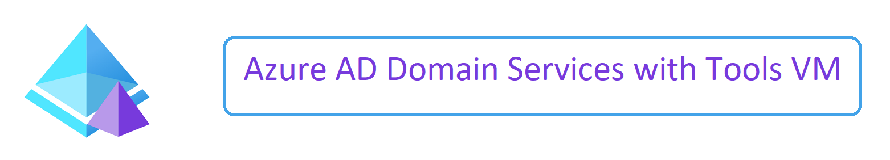
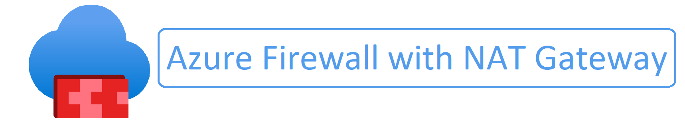
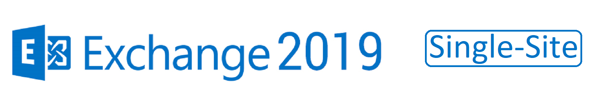

## Collection of Labs to Deploy within Azure for Self-Study or Proof Of Concept

All labs with VM's deploy a Bastion Host for Remote Desktop access

Click on the desired Lab to Deploy

### [Active Directory Single-Site - ReadMe](https://github.com/elliottfieldsjr/KillerHomeLab-ARM/blob/main/Deployments/Deploy-ActiveDirectory-Single-Site.md)

Click the button below to deploy

### [ADFS, WAP and AD Connect Single-Site - ReadMe](https://github.com/elliottfieldsjr/KillerHomeLab-ARM/blob/main/Deployments/Deploy-ADFS-WAP-and-ADConnect-Single-Site.md)

Click the button below to deploy

### [Azure AD Domain Services - ReadMe](https://github.com/elliottfieldsjr/KillerHomeLab-ARM/blob/comingsoon/Deployments/Deploy-AzureAD-DomainServices.md)

Click the button below to deploy

### [Azure AD Domain Services Tools VM - ReadMe](https://github.com/elliottfieldsjr/KillerHomeLab-ARM/blob/comingsoon/Deployments/Deploy-AzureAD-DomainServices-ToolsVM.md)

Click the button below to deploy

### [Azure DevOps Server 2022 with Azure SQL - ReadMe](https://github.com/elliottfieldsjr/KillerHomeLab-ARM/blob/main/Deployments/Deploy-DevOpsServer-2022-with-AzureSQL.md)

Click the button below to deploy

### [Azure Virtual Desktop for Active Directory Add-On - ReadMe](https://github.com/elliottfieldsjr/KillerHomeLab-ARM/blob/comingsoon/Deployments/Deploy-Azure-Virtual-Desktop-ActiveDirectory.md)

Click the button below to deploy

### [Azure Virtual Desktop for Azure AD - ReadMe](https://github.com/elliottfieldsjr/KillerHomeLab-ARM/blob/comingsoon/Deployments/Deploy-Azure-Virtual-Desktop-AzureAD.md)

Click the button below to deploy

### [Azure Virtual Desktop for Azure AD Domain Services Add-On - ReadMe](https://github.com/elliottfieldsjr/KillerHomeLab-ARM/blob/comingsoon/Deployments/Deploy-Azure-Virtual-Desktop-AzureAD-DomainServices.md)

Click the button below to deploy

### [Azure Firewall with NAT Gateway - ReadMe](https://github.com/elliottfieldsjr/KillerHomeLab-ARM/blob/main/Deployments/Deploy-AzureFirewall-with-NATGateway.md)

Click the button below to deploy

### [Exchange 2019 Single Site with Enteprise PKI - ReadMe](https://github.com/elliottfieldsjr/KillerHomeLab-ARM/blob/main/Deployments/Deploy-Exchange2019-Single-Site-with-EnterprisePKI.md)

Click the button below to deploy

### [PKI 2-Tier Certificate Authority with OCSP - ReadMe](https://github.com/elliottfieldsjr/KillerHomeLab-ARM/blob/main/Deployments/Deploy-PKI-2Tier-CA-With-OCSP.md)

Click the button below to deploy

### [PKI Enterprise Certificate Authority with OCSP - ReadMe](https://github.com/elliottfieldsjr/KillerHomeLab-ARM/blob/main/Deployments/Deploy-PKI-Enterprise-CA-With-OCSP.md)

Click the button below to deploy

### [SQL Server StandAlone using an Existing Subnet - ReadMe](https://github.com/elliottfieldsjr/KillerHomeLab-ARM/blob/main/Deployments/Deploy-SQLServer-StandAlone-to-Existing-VNet.md)

Click the button below to deploy

### [SQL Server DomainJoined using an Existing Subnet - ReadMe](https://github.com/elliottfieldsjr/KillerHomeLab-ARM/blob/main/Deployments/Deploy-SQLServer-DomainJoined-to-Existing-VNet.md)

#### Click the button below for the Azure cloud you would like to Deploy to

